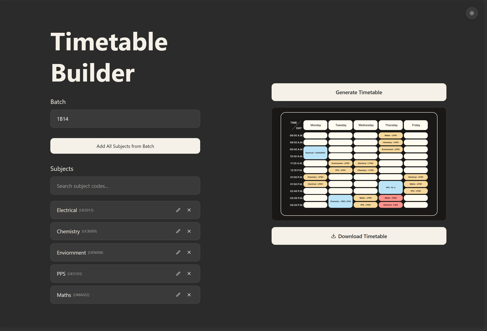
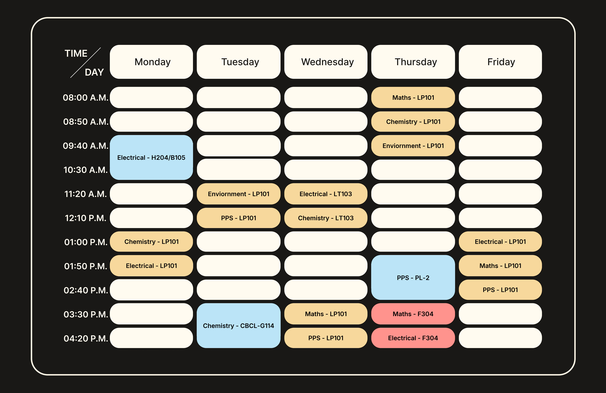

# tiet-timetable

Tool to parse and normalize TIET Excel timetables.

## Overview
This project focuses on reading the official TIET timetable Excel file and converting it into a clean, structured format by handling merged cells, empty rows, and inconsistent layout.

## Demo

### Web UI

### Generated Timetable

## Live Demo
> [!NOTE]
> A beta version of this project is currently deployed at [https://tiet-timetable.onrender.com/](https://tiet-timetable.onrender.com/)

## Tech Stack
- **Backend**: Go, Excelize
- **Frontend**: React, Vite, Tailwind CSS v4

## Status
Work in progress. Parsing, timetable image generation, backend API, and frontend are functional.